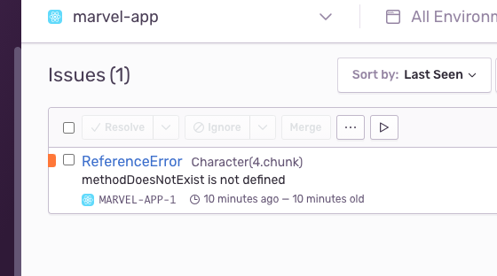

- Storybook:
  https://marvel-sb.netlify.app/

- Server in UPCloud:
  http://209.151.153.198

- Docker images:

  - theenmanuel23/marvel-api
  - theenmanuel23/marvel-client

- Sentry for errors:
  

- Stack:
  Graphql, Backpack, ReactJS, NodeJS, UPCloud, Nginx, Storybook, Netlify, styled-components, monorepo with yarn workspaces, Docker

- info: enmisac@gmail.com
